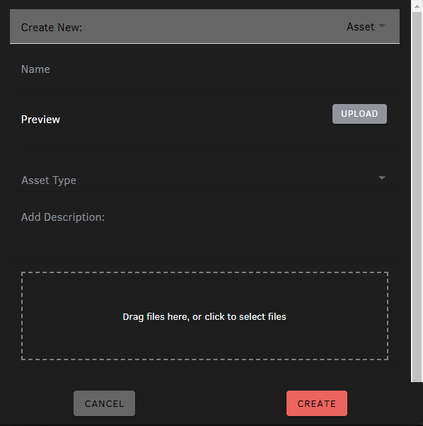

# Create New Asset

Clicking on "New" in the Navigate interface will open up a popup where you can create various items into the local sandbox.

The "Create New" interface allow you to create new assets or regular folder structures.

By default, the interface create a new asset.

The form elements are as follows:

Name: the name of the asset.  This will be the name displayed throughout Loft.  However, the full path of the asset will also include the path from the root of the sandbox.

Preview: upload a preview image that will be used as an thumbnail for the asset through the Loft interface.

Asset Type: 

Description:

Upload Files:

## Saving

Clicking on the "Create Button" will create the asset in the local sandbox.  Note that this is just a local copy and the server does not currently know about this asset.  The user can continue to work on files in the assets.

### Distributed VCS

For distributed systems like "Git", the user can even commit files without accessing the server, giving them a local versioning system with worrying about network bandwidth.  With thse systems, the user will have to "Push" the changes to the server when they are ready.  Pusing to the server will up version the asset.  It is only at this point the other users are able to see this asset.

Until the commits have been push, the user is free to delete all the files in the folder with not consequence to anyone else on the project.

### Centralized VCS

For central systems like "Perforce", the server will immediately be notified on commit.  The new and changed files under the asset root folder will treated as a single changelist when commited.

## Folder Structure

When a new asset is created, it is located in the current folder.  This represents the place for this asset and Loft will download all the files of the asset to the same folder for all other users.  The location of the asset can be arbitrarily anywhere in the folder structure.

