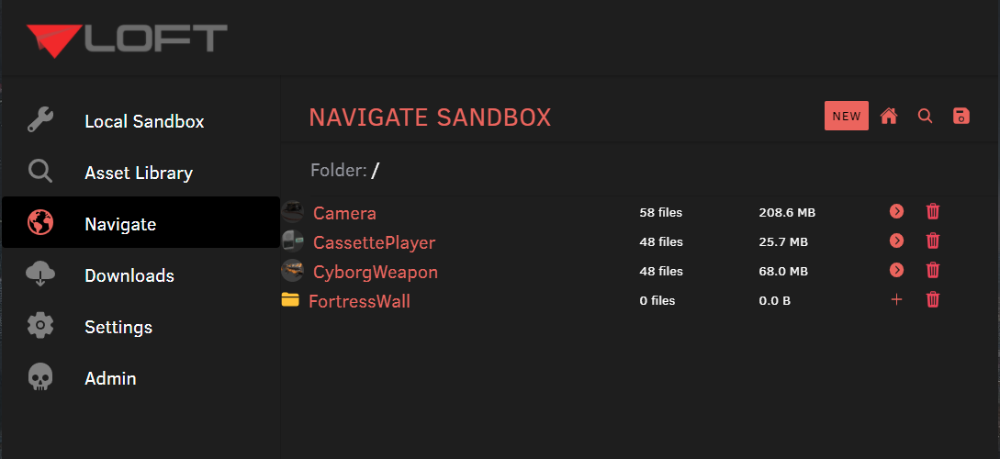

# Navigate

The "Navigate" menu item on the sidebar opens up to the root folder of the currently selected sandbox.

The navigate allows you to navigate the local sandbox.  It is presented as directory structure

## Navigating

The navigate folder view looks a lot like what you would find in Windows Explorer or OSX Finder.  Each file will have a simple file icon and regular folders will have a file icon.  However, whenever a folder is a Loft Asset, Loft will display the preview of the asset with some special buttons on the right to interact with those assets.

The Navigate view allows you to navigate up and down folders to browse through the file structure for assets.  You can use the search mechanism to find assets with the file structure.  This is useful is you have a deeply nested file structure.

## Assets

Assets can be located anywhere in the folder structure.  Any folder at any level can be designated as a Loft Asset.  When a new asset has been created, the user can then start to commit files into this asset.  By marking a folder as an asset, it provides loft with a base folder with which any files under this root asset folder will be considered part of the local asset.

Within Navigate, you are able to create new assets, delete assets locally and open up a detail view which will allow you to commit and push files to the server.

